Easy Login and SignUp for anyone familiar with Springboot and Angular,
but also crazy for me as someone trying to use them for the first time,

Alhamdulilah , by the help of ALLAH anything can be done.

login
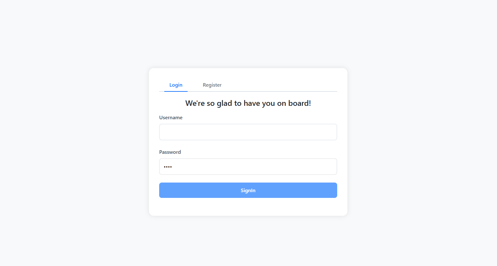

register
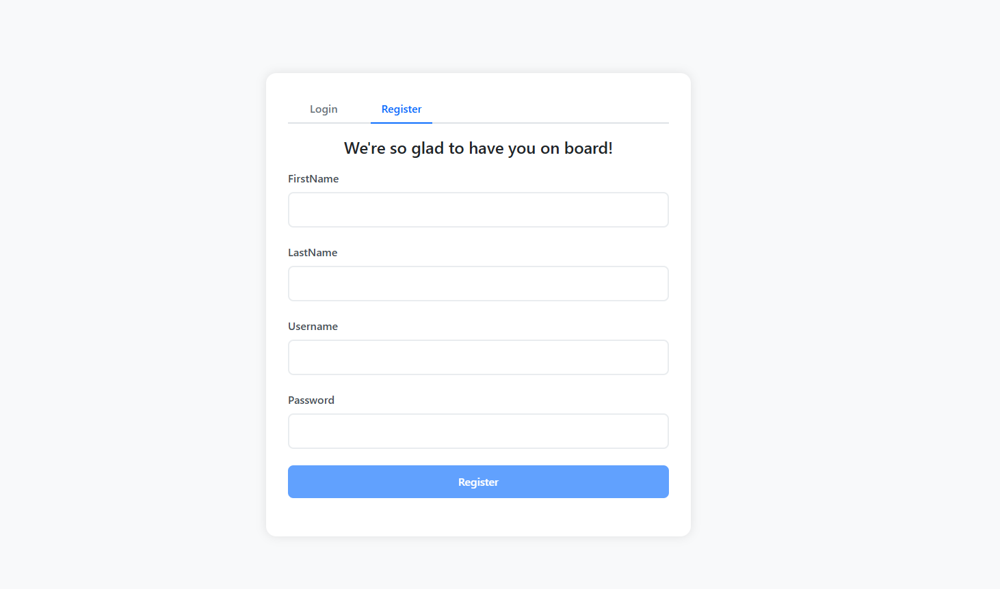

welcome 

bus tracking page 1
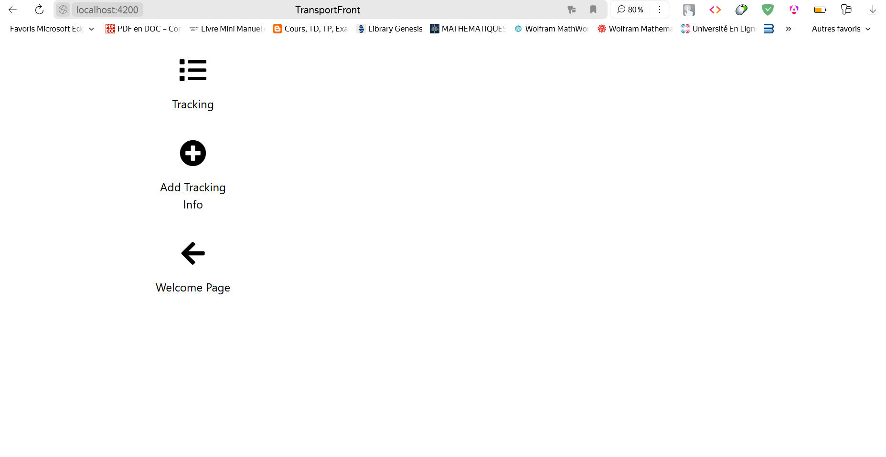

bus tracking page 2
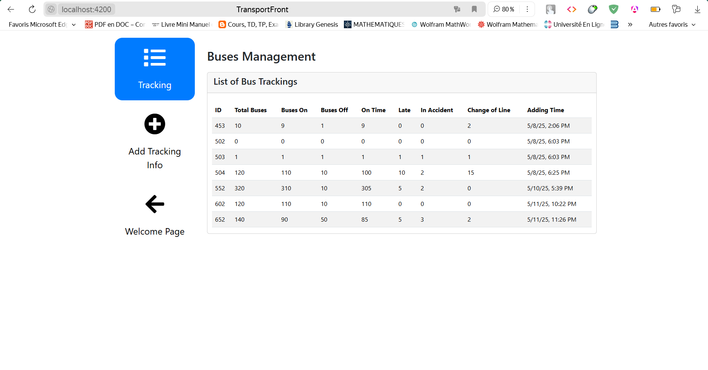

bus tracking page 3
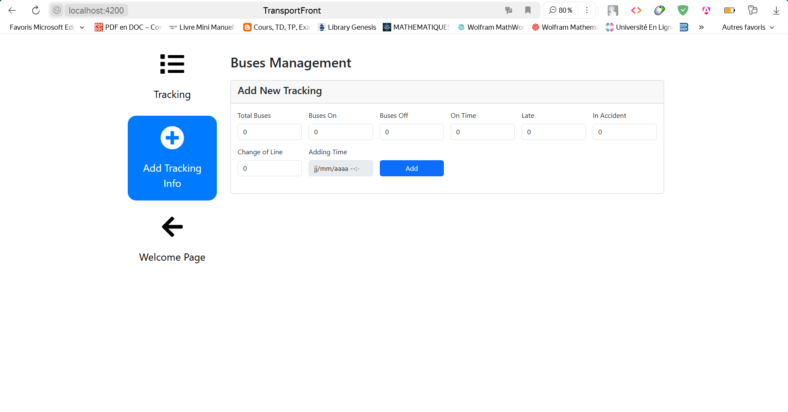

line infos page 1
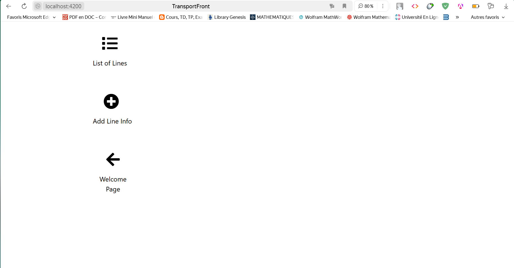

line infos page 2
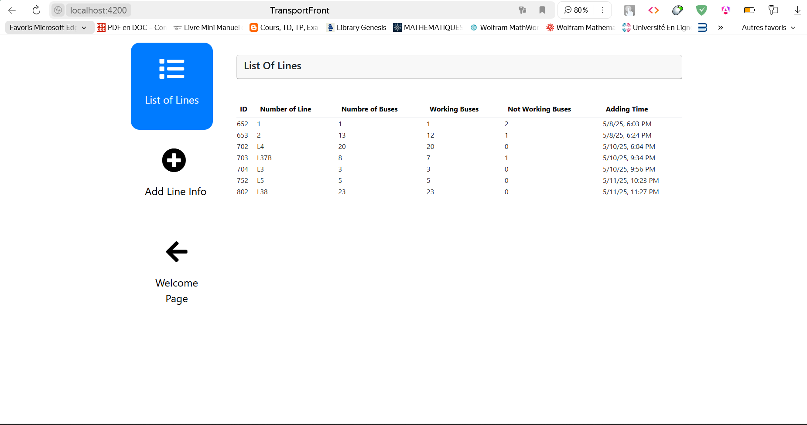

line infos page 3
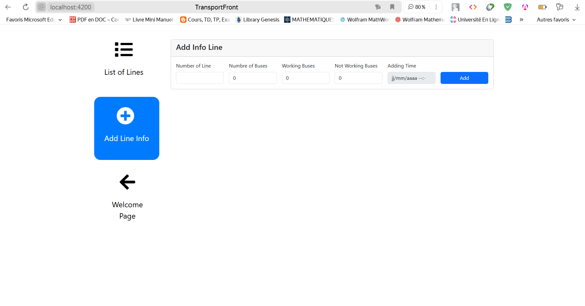

reclamation page 1
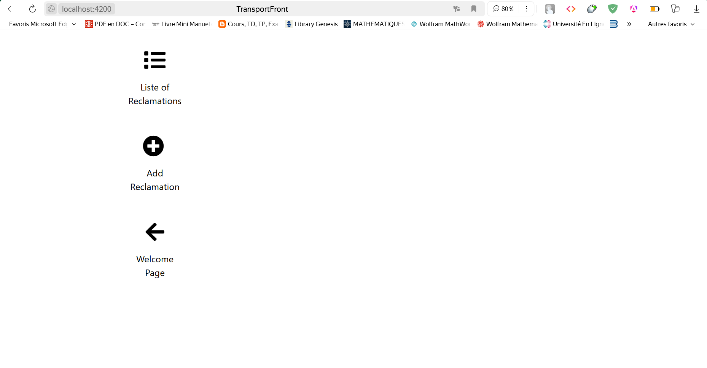

reclamation page 2
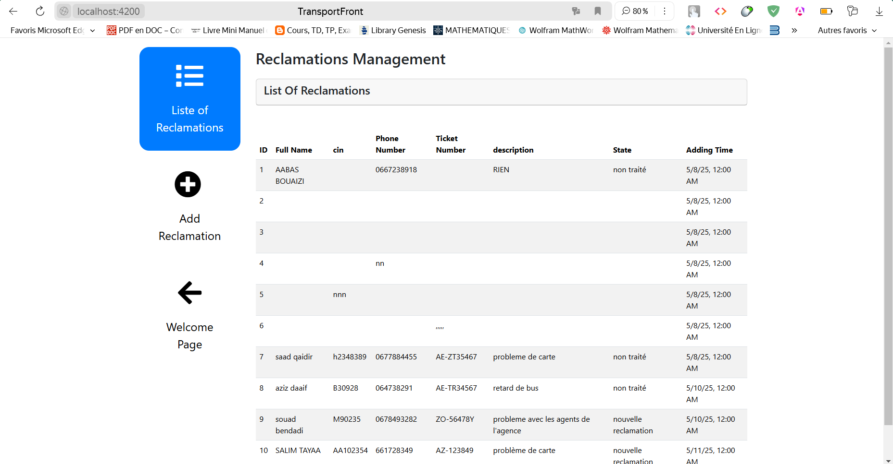

reclamation page 3
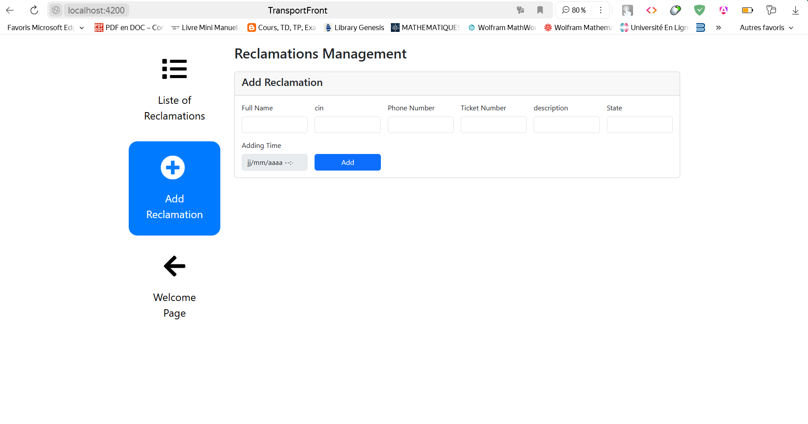

this what the projet is like
